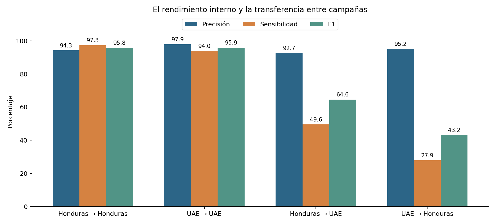
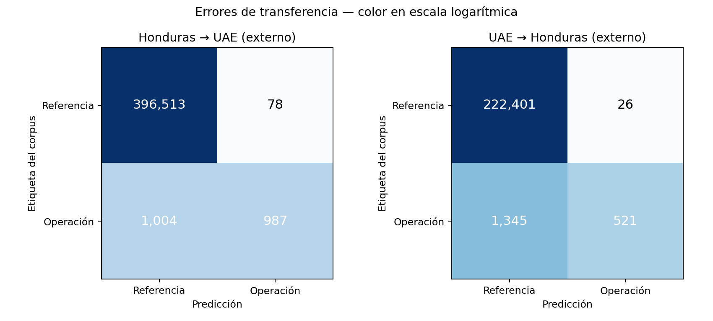
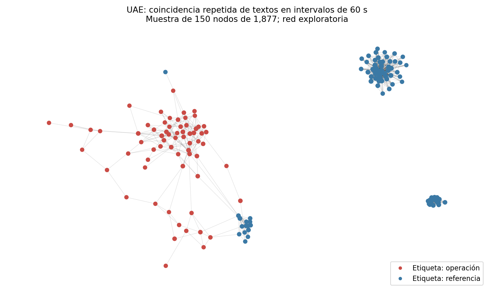

# Validación de Honduras y UAE: resultados para el TFM

Ejecución local: 18 de septiembre de 2026. Todos los resultados proceden de los archivos descargados; no se han simulado datos ni métricas.

**Conclusión:** el clasificador funciona bien dentro de cada campaña, pero su sensibilidad disminuye al aplicarlo a una campaña distinta con el umbral fijado en origen. Se ha realizado una validación externa entre dos campañas; no se ha demostrado un detector universal de perfiles falsos.

En la comparación depurada Honduras → UAE se detectaron 987 de 1991 cuentas positivas (sensibilidad 49.57%), con 78 falsos positivos. En UAE → Honduras se detectaron 521 de 1866 (27.92%), con 26 falsos positivos.

## 1. Procedencia y significado de las etiquetas

Fuente: Cima et al., *Twitter dataset about Information Operations in Honduras and UAE*, [Zenodo v3](https://zenodo.org/records/13912659). Artículo: [Coordinated Behavior in Information Operations on Twitter](https://doi.org/10.1109/ACCESS.2024.3393482). Los archivos positivos proceden del archivo de operaciones de información de Twitter; los de referencia se recuperaron con búsquedas temáticas. «Referencia» significa ausencia en el conjunto de la operación, no autenticidad individual verificada. La etiqueta positiva tampoco demuestra que cada mensaje sea falso ni que la cuenta sea automatizada.

## 2. Auditoría y corrección de la limpieza inicial

Los cuatro MD5 coinciden con los publicados. Se conserva una huella SHA-256 local por archivo. Los originales permanecen intactos.

| Campaña | Registros originales | Duplicados retirados | Colisiones conservadas | Fuera de periodo | Tweets usados | Cuentas | Positivas |
|---|---:|---:|---:|---:|---:|---:|---:|
| honduras | 1,262,830 | 7,362 | 894 | 0 | 1,255,468 | 224,685 | 1,866 |
| uae | 2,849,468 | 99,564 | 3,636 | 247 | 2,749,657 | 398,974 | 1,991 |

La primera ejecución de Honduras eliminaba cualquier repetición de tweetid. La auditoría ampliada comprobó que hay identificadores compartidos por mensajes distintos. Ahora se elimina solo la repetición de tweetid, usuario, fecha y texto; se conservan las colisiones distintas. Por ello cambian los recuentos y algunos resultados respecto al primer informe. Los resultados depurados de este informe son la referencia actual.

Las ventanas usadas son [2019-09-10, 2020-01-09) UTC para Honduras y [2019-01-26, 2019-05-27) UTC para UAE. Se incluyen los días iniciales observados en los positivos, que difieren en unas horas de la descripción resumida de Zenodo. En UAE había registros de referencia anteriores, incluso de 2011; se excluyen del conjunto depurado.

Se detectaron 392 userids compartidos entre campañas. Se excluyen del destino en cada transferencia y de ambas partes del conjunto combinado. La comprobación depende de los identificadores disponibles en el corpus.

## 3. Diseño y resultados entre campañas

Las 17 variables describen actividad, repetición, uso de entidades y metadatos de perfil. No se usan identificadores, idioma, texto literal, etiqueta good ni nombre de campaña como predictores. Se mantiene el Random Forest original: 300 árboles, mínimo 3 muestras por hoja, max_features=0.8, ponderación balanced_subsample y semilla 42. Cada fuente se divide por cuentas en 60% entrenamiento, 20% validación y 20% prueba; el umbral maximiza F1 solo en validación de origen. La campaña de destino no se usa para elegir umbral o hiperparámetros.

| Experimento | Cuentas | Positivas | Precisión | Sensibilidad | F1 | AP | FP | FN |
|---|---:|---:|---:|---:|---:|---:|---:|---:|
| Honduras → Honduras (interno) | 44,937 | 373 | 94.29% | 97.32% | 0.9578 | 0.9900 | 22 | 10 |
| UAE → UAE (interno) | 79,795 | 398 | 97.91% | 93.97% | 0.9590 | 0.9874 | 8 | 24 |
| Honduras → UAE (externo) | 398,582 | 1,991 | 92.68% | 49.57% | 0.6459 | 0.7814 | 78 | 1004 |
| UAE → Honduras (externo) | 224,293 | 1,866 | 95.25% | 27.92% | 0.4318 | 0.8281 | 26 | 1345 |

Los tests internos usan el 20% reservado; las transferencias usan todas las cuentas del destino excepto las compartidas. Son poblaciones y prevalencias diferentes: la comparación no es un ensayo pareado con idénticos sujetos.





La precisión mide qué proporción de alertas coincide con la etiqueta positiva; la sensibilidad mide cuántas cuentas positivas se detectan. Una precisión alta acompañada de sensibilidad baja indica que quedan muchas cuentas de la operación sin detectar. AP evalúa el orden de los scores sin elegir un umbral; su baseline es la prevalencia. No se ajustó retrospectivamente el umbral con las etiquetas del destino.

Se utiliza una única partición por experimento. Cambiar el número de cuentas tras depurar los datos cambia la partición aunque se conserve la semilla; también cambia el umbral óptimo de validación. Por tanto, las diferencias respecto al modelo original no pueden atribuirse solo a la corrección de registros. No se ha cuantificado la variabilidad entre semillas.

### Comprobación del modelo original congelado

El modelo de la primera ejecución, conservado sin modificar, obtuvo sobre UAE depurado precisión 95.79%, sensibilidad 21.70% y F1 0.3538: 432 detectadas, 1559 no detectadas y 19 falsos positivos. La conclusión de pérdida de sensibilidad no depende solo del reentrenamiento tras corregir la limpieza.

## 4. Entrenamiento combinado

Se mezclan las cuentas de ambas campañas y se estratifica por campaña y etiqueta. Cada usuario aparece en una única partición. Esto evalúa cuentas nuevas de dos campañas ya conocidas; no equivale a validar en una tercera campaña desconocida.

| Experimento | Cuentas | Positivas | Precisión | Sensibilidad | F1 | AP | FP | FN |
|---|---:|---:|---:|---:|---:|---:|---:|---:|
| Modelo conjunto: prueba global | 124,575 | 771 | 97.78% | 91.31% | 0.9443 | 0.9852 | 16 | 67 |
| Modelo conjunto: prueba Honduras | 44,859 | 373 | 97.92% | 88.47% | 0.9296 | 0.9780 | 7 | 43 |
| Modelo conjunto: prueba UAE | 79,716 | 398 | 97.65% | 93.97% | 0.9577 | 0.9921 | 9 | 24 |

## 5. Evaluación temporal

Se recalculan las variables separadamente antes y después de los cortes 2019-11-10 UTC (Honduras) y 2019-03-28 UTC (UAE). Dentro del periodo inicial se entrena con el 80% de las cuentas y se selecciona el umbral con el 20% restante. La evaluación posterior excluye todas las cuentas ya vistas en el periodo inicial, incluidas las de validación.

| Experimento | Cuentas | Positivas | Precisión | Sensibilidad | F1 | AP | FP | FN |
|---|---:|---:|---:|---:|---:|---:|---:|---:|
| Temporal Honduras: cuentas nuevas | 94,749 | 667 | 96.31% | 86.06% | 0.9089 | 0.9560 | 22 | 93 |
| Temporal UAE: cuentas nuevas | 154,868 | 9 | 36.36% | 88.89% | 0.5161 | 0.8899 | 14 | 1 |

HONDURAS: 129,936 cuentas iniciales; 148,133 posteriores; 53,384 posteriores excluidas por haber aparecido antes; 94,749 nuevas, con 667 positivas.

UAE: 244,106 cuentas iniciales; 261,224 posteriores; 106,356 posteriores excluidas por haber aparecido antes; 154,868 nuevas, con 9 positivas.
**Muestra positiva muy pequeña:** las métricas temporales son inestables; cada cuenta tiene gran impacto en la sensibilidad. No usar este resultado como evidencia sólida de generalización temporal.

Esta es una prueba retrospectiva con la ventana posterior completa. No mide el tiempo hasta la primera alerta, y los contadores de seguidores del corpus podrían reflejar la fecha de recogida, no la de publicación. Por ello no constituye una demostración de alerta temprana en producción. UAE precede cronológicamente a Honduras: Honduras → UAE es transferencia entre contextos, no predicción hacia el futuro.

## 6. Redes de coincidencia temporal de mensajes

Se conecta una pareja cuando comparte al menos tres textos idénticos diferentes en los mismos intervalos fijos de 60 segundos. Se cuentan textos distintos, aunque aparezcan en varios intervalos. Se omiten textos de menos de 30 caracteres y eventos de más de 50 usuarios. Las etiquetas no intervienen en la creación de enlaces. Son redes exploratorias de coincidencia repetida, no prueba de intención maliciosa.

| Campaña | Nodos | Enlaces | Componentes | Nodos positivos | Nodos de referencia | Cobertura de positivos |
|---|---:|---:|---:|---:|---:|---:|
| honduras | 1,915 | 31,252 | 217 | 1,400 | 515 | 75.03% |
| uae | 1,877 | 4,086 | 315 | 920 | 957 | 46.21% |




Las figuras muestran una selección de hasta 150 nodos, priorizando grado y componentes mayores; la red completa está en GraphML y CSV. Los nodos aislados no se incluyen. Los límites de intervalo pueden separar publicaciones cercanas; los textos truncados, el idioma, la popularidad del mensaje y la selección de eventos afectan a la red. No se controló estadísticamente una hipótesis nula de coincidencia ni se ajustó por múltiples comparaciones. Las cifras de cobertura son descriptivas del corpus completo, no métricas de un clasificador probado en un test independiente. No se fusionaron estas señales con el clasificador evaluado.

## 7. Interpretación para la memoria

La evaluación aporta evidencia de que una validación aleatoria dentro de una misma campaña puede sobreestimar la utilidad fuera de ese contexto. Se observa buena separación interna y una pérdida de sensibilidad en ambas transferencias con umbrales fijados en origen. La combinación de campañas amplía la representación del entrenamiento, pero su prueba interna no resuelve por sí misma la generalización a nuevas operaciones.

Los grafos complementan la clasificación individual con agrupaciones de comportamiento compartido y permiten orientar una revisión OSINT. La etiqueta del corpus debe usarse como referencia experimental, sin equiparar coincidencia temporal, perfil falso, bot y desinformación.

Persisten sesgos de recogida entre positivos y referencia, dependencia entre cuentas de una misma operación, diferencias de idioma y cobertura, y ausencia de verificación individual de las cuentas de referencia. Las diferencias de medianas se exportan en medianas_variables.csv; no demuestran por sí solas qué factor causa el cambio de rendimiento.

Los JSON incluyen intervalos del 95% por bootstrap estratificado de 2.000 réplicas equivalentes sobre la matriz de confusión para precisión, sensibilidad y F1, con modelo y umbral fijos. No incluyen variabilidad de reentrenamiento ni dependencia entre cuentas. La exactitud de un baseline que siempre responde referencia es 1 − prevalencia y tiene sensibilidad y F1 nulos.

El siguiente estudio justificable es reservar una tercera campaña completamente intacta y validar en ella un método fijado con Honduras y UAE, incluyendo selección de señales de coordinación solo con datos de desarrollo. También hace falta una simulación por ventanas cortas y metadatos disponibles en cada momento para sostener una afirmación de alerta temprana.

## 8. Entregables y reproducción

- resumen_metricas.csv: comparación numérica; *_resultados.json: métricas, errores y umbrales.
- *_modelo.joblib: modelos entrenados; *_predicciones.csv.gz: scores y decisiones por cuenta.
- *_particiones.csv.gz: asignación auditable a entrenamiento, validación y prueba.
- *_curado.csv.gz: variables por cuenta; *_early.csv.gz / *_late.csv.gz: ventanas temporales.
- *_coordinacion.graphml.gz: redes completas para herramientas de grafos; *_aristas.csv.gz / *_nodos.csv.gz / *_componentes.csv: tablas de red.
- *_auditoria.json, PROTOCOLO.md y versiones.json: integridad, decisiones y entorno.
- preparar.py, experimentos.py, coordinacion.py, informe.py, verificar.py: código de ejecución y controles.

Los nombres sin «curado» del primer experimento cruzado se conservan como referencia histórica. Para nuevas conclusiones, usar las filas depuradas de resumen_metricas.csv.

Desde la raíz del proyecto, con el entorno .venv de la primera ejecución:

```bash
.venv/bin/python validacion_campanas/preparar.py honduras --data-dir /ruta/a/zenodo
.venv/bin/python validacion_campanas/preparar.py uae --data-dir /ruta/a/zenodo
.venv/bin/python validacion_campanas/preparar.py honduras --mode temporal --data-dir /ruta/a/zenodo
.venv/bin/python validacion_campanas/preparar.py uae --mode temporal --data-dir /ruta/a/zenodo
OMP_NUM_THREADS=3 OPENBLAS_NUM_THREADS=3 .venv/bin/python validacion_campanas/experimentos.py curated
OMP_NUM_THREADS=3 OPENBLAS_NUM_THREADS=3 .venv/bin/python validacion_campanas/experimentos.py combined
OMP_NUM_THREADS=3 OPENBLAS_NUM_THREADS=3 .venv/bin/python validacion_campanas/experimentos.py temporal
MPLCONFIGDIR=/tmp/tfm-matplotlib .venv/bin/python validacion_campanas/coordinacion.py honduras --data-dir /ruta/a/zenodo
MPLCONFIGDIR=/tmp/tfm-matplotlib .venv/bin/python validacion_campanas/coordinacion.py uae --data-dir /ruta/a/zenodo
MPLCONFIGDIR=/tmp/tfm-matplotlib .venv/bin/python validacion_campanas/informe.py
.venv/bin/python validacion_campanas/verificar.py
```

Conservar el READ.ME original al redistribuir datos y su aviso de uso para investigación. Los scores no son probabilidades calibradas de autenticidad ni de culpabilidad.
